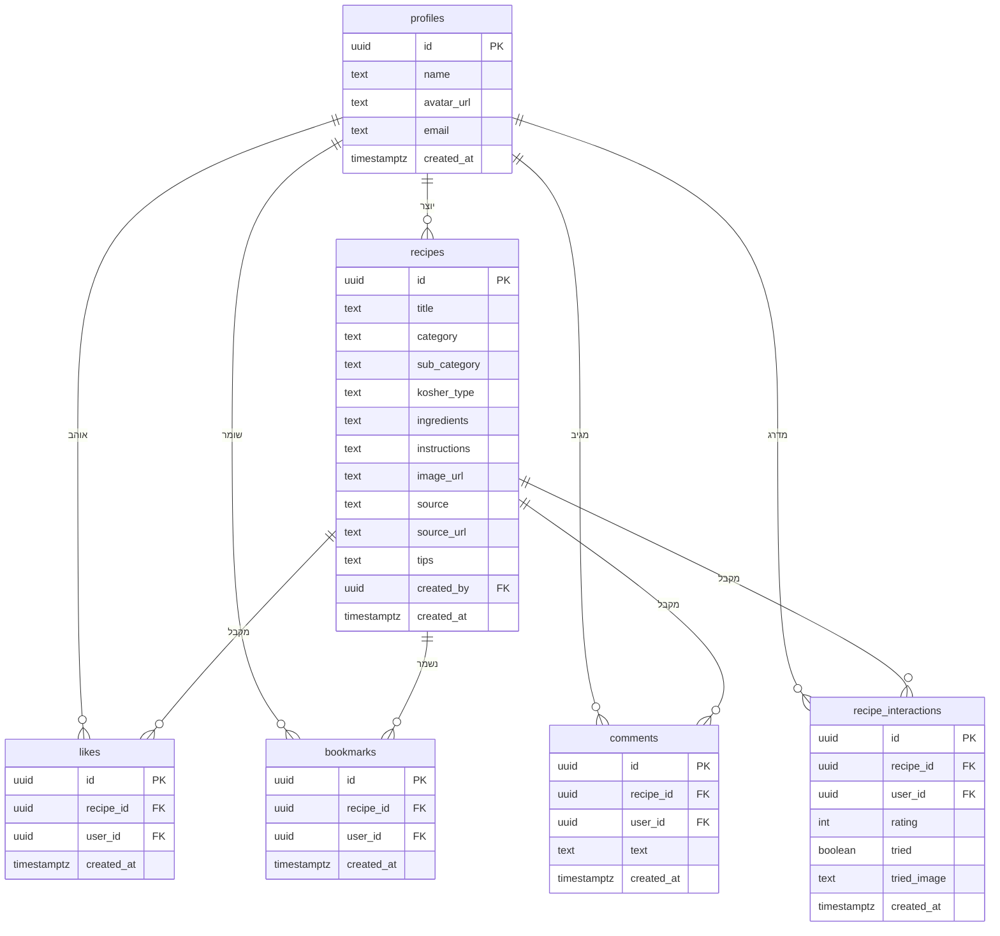

# CookBook 🍳

אפליקציית מתכונים חכמה — אלפי מתכונים מהבלוגים הכי טובים, מסודרים במקום אחד.

**קישור לאתר החי:** [cook-book-git-main-shoval-david.vercel.app](https://cook-book-git-main-shoval-david.vercel.app)

---

## סקירה כללית

CookBook היא אפליקציית ווב המאגדת מתכונים מבלוגי בישול מובילים בישראל (ניקי במטבח, 10 דקות וחן במטבח) תחת ממשק אחד נוח ומסודר.  
המשתמש יכול לעיין במתכונים לפי קטגוריות (בשרי / חלבי / דגים), לסנן לפי סוג מנה או בלוג מקור, לחפש מתכונים, לשמור מועדפים, לדרג, להגיב ולסמן מה כבר ניסה.

---

## הבעיה שפותרת

כל בלוג בישול הוא עולם בפני עצמו — עיצוב שונה, מנוע חיפוש שונה, ואין דרך לחפש "עוף בלימון" ולקבל תוצאות מ-10 אתרים שונים בו-זמנית.  
CookBook מייבאת את המתכונים ישירות מהמקורות ומאחדת אותם תחת קטגוריות ברורות, כך שהמשתמש מוצא מה שהוא מחפש בלחיצה אחת.

---

## קהל היעד

**משפחות ישראליות, צעירים ומבוגרים** שמחפשים השראה לבישול יומיומי — מי שכבר מכיר בלוגי בישול ישראליים ורוצה לנהל את המתכונים האהובים עליו במקום אחד.

---

## מתחרים וייחוד

| מתחרה | מה חסר בו |
|--------|-----------|
| 10dakot.co.il | רק המתכונים של האתר עצמו |
| foody.co.il | ממשק מסורבל, חיפוש חלש |
| מתכונים - Foods (אפליקציה) | אין איזור אישי, תוכן מלא מאחורי מנוי בתשלום |
| מתכונים ב-10 דקות (אפליקציה) | אין אפשרות למשתמשים להגיב, אפליקציה איטית |
| מתכונית (אפליקציה) | לא מחולק לפי קטגוריות, פרסומות רבות |

**היתרון של CookBook:**
- מתכונים מ**כמה בלוגים** תחת ממשק אחד
- ניווט **3 רמות** — קטגוריה → תת-קטגוריה → מתכון
- **ייבוא אוטומטי** של מתכון מכל URL
- **תגובות, דירוג כוכבים, וסימון "ניסיתי את זה"** לכל מתכון
- **הפרדה בשרי / חלבי / דגים** — חשוב לשומרי כשרות

---

## טכנולוגיות

| שכבה | טכנולוגיה |
|------|-----------|
| Frontend | React 19 + Vite + Tailwind CSS |
| State | Zustand |
| Backend | Node.js + Express |
| Database | Supabase (PostgreSQL) |
| Auth | Supabase Auth (Google OAuth) |
| Storage | Supabase Storage (העלאת תמונות) |
| Deploy Frontend | Vercel |
| Deploy Backend | Render |

---

## שירותים חיצוניים ואינטגרציות

| שירות | סוג | למה משמש |
|--------|-----|-----------|
| **Supabase** | Database + Auth + Storage | שמירת מתכונים, משתמשים, תמונות; אימות דרך גוגל |
| **Google OAuth** (דרך Supabase) | אוטנטיקציה | התחברות משתמשים עם חשבון גוגל |
| **Vercel** | Hosting | אחסון ו-deploy אוטומטי של ה-Frontend |
| **Render** | Hosting | אחסון שרת ה-Backend (Express) |
| **Recipe structured data (JSON-LD)** | Web Scraping | ייבוא מתכונים אוטומטי מאתרי בישול לפי URL |

---

## ERD — מבנה בסיס הנתונים

---

## פיצ'רים עיקריים

- **ניווט חכם** לפי קטגוריה, תת-קטגוריה וסוג כשרות
- **ייבוא מתכון** מכל URL (JSON-LD structured data)
- **סינון לפי בלוג מקור**
- **חיפוש חופשי** לפי שם מתכון
- **לייקים ושמירה** למועדפים
- **תגובות** למתכון
- **דירוג כוכבים** (1–5)
- **כפתור "ניסיתי את זה"**
- **טיפים** שהבעלים של המתכון יכול להוסיף
- **העלאת תמונה** למתכון

---

## משתמש לבדיקה

| שדה | ערך |
|-----|-----|
| אימייל | shovalddd363@gmail.com |
| כניסה | דרך Google OAuth |
